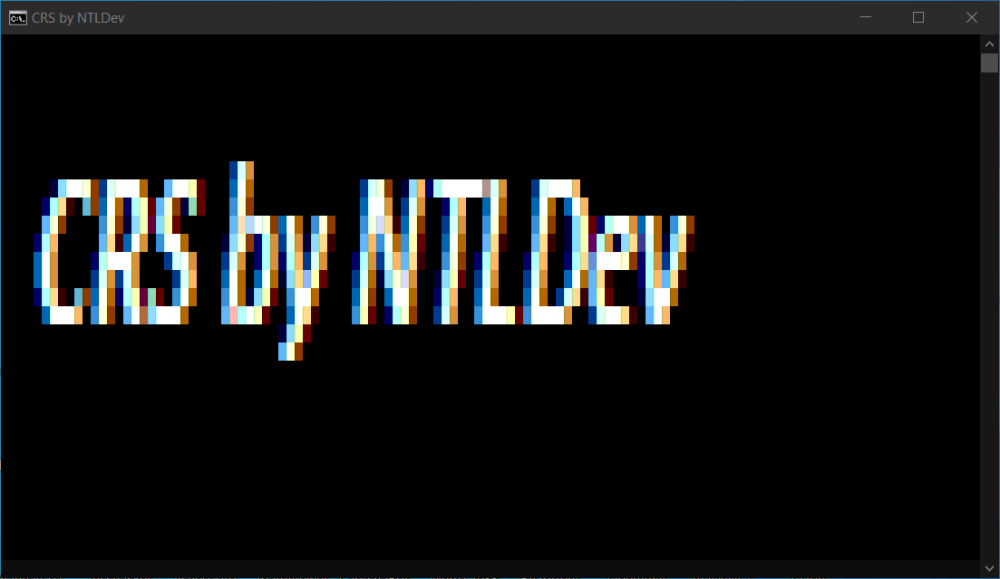

# CRS - New innovation project

</img>

CRS is Console Render System.<br>
CRS is needed to create COLORED games and projects in CONSOLE.<br>
For start you need: Python >= 3.3

Example code:

```
# Pycode by NTLDev

import CRS
from PIL import Image
from CRS import Tools

Window = CRS.Win(120, 29, "Window1") # standart windows console is 120, 30 but y (30) is recomended to be 29.
ImgTool = Tools.Image(Image.open("Image1.png"))
img = ImgTool.retImage(Window)
xsch = -1
for x in img:
    xsch += 1
    sch = -1
    for y in x:
        sch += 1
        Window.edit_rgb(sch, xsch, y)

Window.print()

```

Example code on C++:
```
// Cpp Code by NTLDev
#include <iostream>
#include "CRS++/CRS.h"
#include <thread>
#include <chrono>
using namespace std;

int main(){
    system("chcp 65001 > nul");
    Win *pixs = new Win(120, 30, "CRS_Window");
    using namespace this_thread; // sleep_for, sleep_until
    using namespace chrono; // nanoseconds, system_clock, seconds

    while (true){
        sleep_for(milliseconds(50));
        pixs->edit_rgb(4, 4, {255, 0, 0});
        pixs->print();
        sleep_for(milliseconds(50));
        pixs->edit_rgb(4, 4, {0, 255, 0});
        pixs->print();
        sleep_for(milliseconds(50));
        pixs->edit_rgb(4, 4, {0, 0, 255});
        pixs->print();
    }
}
```
